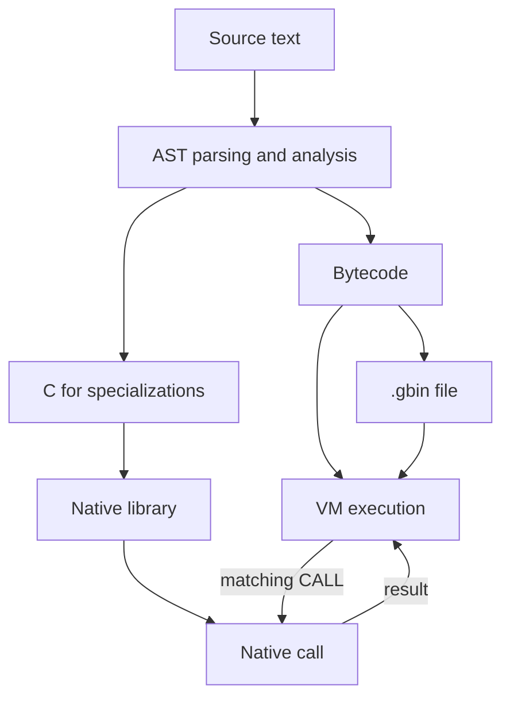

# 3. A Program Through the System

[Contents](index.md) · [Русский](../ru/03-program-pipeline.md) · [Previous chapter](02-implemented-language.md)

Edition 1. Implementation described: [commit 09d0cff, after PR #93](https://github.com/kniazkov/g0at/tree/09d0cffb08303b07c1c3af27ccbfc6af94466b97).

<a id="section-3-1"></a>

## 3.1. A Program to Observe

A program's result is easy to see on the screen. The representations it passes through before reaching that point are much less obvious. We will follow a small function: it returns zero for a negative argument and otherwise adds one according to Goat's integer arithmetic rules.

[Example source](../examples/03-pipeline.goat):

```goat
const step = func(x) {
    if (x < 0) { return 0; }
    return x + 1;
};
print(step(4));
print("\n");
```

The program prints `5` and a newline. It contains a declaration, a parameter, a condition, two returns, arithmetic, and calls. That is enough to expose the main stages without the distraction of a large algorithm.

For the experiments, copy the source to a working directory. Run the following commands from the repository root after building Goat. On Linux:

```sh
mkdir -p build/book
cp docs/book/examples/03-pipeline.goat build/book/pipeline.goat
./goat --native off --save-analysis build/book/analysis.txt build/book/pipeline.goat
```

In Windows PowerShell:

```powershell
New-Item -ItemType Directory -Force .\build\book | Out-Null
Copy-Item .\docs\book\examples\03-pipeline.goat .\build\book\pipeline.goat
.\goat.exe --native off --save-analysis .\build\book\analysis.txt .\build\book\pipeline.goat
```

The result appears on the screen, and the analyzer's information goes into `analysis.txt`. Subsequent generated files will also reside in `build/book`.

<a id="section-3-2"></a>

## 3.2. Text Becomes a Tree

The [launcher module](https://github.com/kniazkov/g0at/blob/09d0cffb08303b07c1c3af27ccbfc6af94466b97/src/cli/launcher.c) reads the source file as UTF-8 (an encoding for text in different languages). It converts the text to an internal C wide-character representation for further processing. The scanner (the mechanism that recognizes elements of the notation) identifies tokens: names, numbers, keywords, brackets, and operators, retaining their source coordinates.

For example, `x + 1` yields the name `x`, the `+` sign, and the integer `1`. This is not yet an instruction to add values. Syntax analysis must establish that the elements form a single expression and determine its relation to `return`.

Goat's [parser](https://github.com/kniazkov/g0at/blob/09d0cffb08303b07c1c3af27ccbfc6af94466b97/src/parser/parser.c) first groups brackets and then applies reduction rules (replacing a matching sequence of elements with one larger element). The rules account for operator precedence and language constructs. The result is an AST, an abstract syntax tree (a structure describing meaningful parts of the notation without needing to retain every original bracket and separator).

In our example, the function node contains a parameter list and a body. The body contains a condition and the return of `x + 1`; the condition contains the comparison `x < 0` and a branch returning zero. This describes structure, not a sequence of machine instructions. A branch node, for example, can exist in the tree even when a particular call does not take that branch.

Tokens are needed to construct the tree; after parsing, the launcher frees their memory. Tree nodes live longer: the analyzer and code generators still need them.

<a id="section-3-3"></a>

## 3.3. Names Gain Meaning, Values Gain Descriptions

The tree contains several uses of the name `x`. The system must establish that they refer to the parameter of `step`, and that `step` in the call refers to the declared constant. Name binding (connecting a name's use with a specific declaration) takes place in the [analyzer](https://github.com/kniazkov/g0at/blob/09d0cffb08303b07c1c3af27ccbfc6af94466b97/src/analysis/analysis.c). It assigns scopes and identifiers to nodes, resolves names, and then begins computing information about the program.

This order matters. Before reasoning about a variable's value, the system must identify the variable. Binding runs even with `--optimize none`, which disables optional analysis and transformations.

When analyzing `step(4)`, the particular argument value is known. Preparing a native function, however, requires a more general description. A specialization (a function implementation for a particular ordered set of parameter types) here has one integer parameter. It must also be correct for other integers, including negative and boundary values.

This uses abstract values (descriptions of possible values, such as “exactly 4,” “an integer,” or “an unknown value”). The analyzer computes these descriptions instead of executing every possible input in the ordinary way. For our example, the report includes a record about the particular call:

```text
#2 pipeline.goat, 1.14: write x = 4
```

The `function-summary` line describes the integer specialization; its fields include:

```text
(integer) -> integer effects=none c=supported purity=pure
```

This means that the parameter and result are integers, analysis found none of the effects it tracks, purity is proven, and C generation is supported. `write x = 4` and the summary `(integer) -> integer` answer different questions. Information about a single positive argument cannot justify deleting the negative branch from an implementation for all integers.

Besides values, the analyzer considers calls, recursion, and effects, checks C generation eligibility, marks unreachable regions, and simplifies the tree. The analysis log records observations from different stages; it is not a trace of instructions actually executed. Part IV will examine these stages in detail.

<a id="section-3-4"></a>

## 3.4. The Tree Becomes VM Instructions

The bytecode generator traverses the tree and emits virtual-machine instructions. Bytecode (code in Goat's instruction set) makes the order of actions explicit: load a value, compare, jump, call a function, return a result. Data such as names and strings is accumulated separately; the [linker](https://github.com/kniazkov/g0at/blob/09d0cffb08303b07c1c3af27ccbfc6af94466b97/src/codegen/linker.c) combines the prepared code and data.

Function bodies are generated later: the surrounding program's code is created first, then function code is placed and the necessary addresses are resolved. Creating a function therefore does not immediately execute its body.

Inspect the bytecode without optional transformations. On Linux:

```sh
./goat --optimize none --native off --print-bytecode build/book/pipeline.goat
```

In Windows PowerShell:

```powershell
.\goat.exe --optimize none --native off --print-bytecode .\build\book\pipeline.goat
```

The command prints a listing (a textual representation of instructions) and then runs the program. It contains the following sequence; only the instructions evaluating `print(step(4))` are shown here, without numeric string-data indices:

| Instruction | Action |
|---|---|
| `ILOAD32 4` | Push the integer `4` onto the value stack |
| `VLOAD "step"` | Find the function `step` and push it onto the stack |
| `CALL 1` | Call it with one argument and obtain the result |
| `VLOAD "print"` | Find the function `print` |
| `CALL 1` | Pass the result of `step` to it |
| `POP` | Discard the unused result of the call to `print` |

A stack (storage from which the most recently added value is removed first) passes intermediate results between instructions. The body of `step` contains loads of `x` and `0`, the `LESS` comparison, and the conditional jump `JIF`. The selected path ends with `RET`, returning the result.

The [VM](https://github.com/kniazkov/g0at/blob/09d0cffb08303b07c1c3af27ccbfc6af94466b97/src/vm/vm.c) reads these instructions and invokes operations on runtime objects. The addition's result becomes an integer object, and `print` turns the resulting value into output. By the start of ordinary execution, the launcher has freed the tree and source text: the VM works with the prepared bytecode.

<a id="section-3-5"></a>

## 3.5. A Branch toward Machine Code

For a supported specialization, the same analyzed tree can produce C. This is another output of program preparation. We will inspect it first, then run the program with native execution (the processor executing the generated machine instructions).

On Linux:

```sh
./goat --save-c build/book/pipeline.goat
./goat --native required --save-native build/book/native.txt build/book/pipeline.goat
```

In Windows PowerShell:

```powershell
.\goat.exe --save-c .\build\book\pipeline.goat
.\goat.exe --native required --save-native .\build\book\native.txt .\build\book\pipeline.goat
```

The first command saves `pipeline.c` without executing the program. The second performs its own preparation; it does not require C to have been saved beforehand. It needs an external C compiler: `cc` on Linux and `gcc` on Windows by default, with the choice configurable through the `CC` environment variable.

The [native pipeline](https://github.com/kniazkov/g0at/blob/09d0cffb08303b07c1c3af27ccbfc6af94466b97/src/codegen/native_pipeline.c) constructs a C module, compiles a dynamic library, loads it, and checks its interface. An ABI (a convention for data representation and function calls) connects the VM to the machine-code function. A suitable specialization is bound to the Goat function object.

The surrounding program continues to execute in the VM. When the VM reaches `CALL`, the [function object](https://github.com/kniazkov/g0at/blob/09d0cffb08303b07c1c3af27ccbfc6af94466b97/src/model/function.c) checks whether a native call can be made with the actual arguments. In our example, the body of `step` runs as machine code, while the outer calls to `print` remain part of the ordinary execution path.

The expected fields in `native.txt` include:

```text
preparation=ready
bound=1
succeeded=1
retries=0
```

A library was prepared, one function was bound, one entry completed natively, and no VM retry was needed. The existence of `pipeline.c` alone does not confirm native execution; the run counters do.

The `off` mode disables this path. `auto` permits continuation in the VM if native preparation fails. `required` demands successful preparation of at least one bound function; it does not mean that the entire program becomes machine code, nor does it disable the supported VM fallback on resource limits. Mode policy is implemented in the [native execution module](https://github.com/kniazkov/g0at/blob/09d0cffb08303b07c1c3af27ccbfc6af94466b97/src/cli/native_execution.c).

<a id="section-3-6"></a>

## 3.6. Prepare Now, Execute Separately

Every run so far has begun with source code. Separate compilation (saving a prepared program for a later, separate run) avoids repeating source reading, parsing, and analysis.

On Linux:

```sh
./goat --compile --native off build/book/pipeline.goat
./goat --run --native off build/book/pipeline.gbin
./goat --compile --native required build/book/pipeline.goat
./goat --run --native required --save-native build/book/saved-native.txt build/book/pipeline.gbin
```

In Windows PowerShell:

```powershell
.\goat.exe --compile --native off .\build\book\pipeline.goat
.\goat.exe --run --native off .\build\book\pipeline.gbin
.\goat.exe --compile --native required .\build\book\pipeline.goat
.\goat.exe --run --native required --save-native .\build\book\saved-native.txt .\build\book\pipeline.gbin
```

The first command saves bytecode in `pipeline.gbin`; the second executes it and prints `5`. The third saves `pipeline.gbin` again, now with an association to a native library: `pipeline.so` on Linux or `pipeline.dll` on Windows appears alongside it. The fourth loads this pair and also prints `5`. Commands with `--compile` do not execute the user program.

A separate run no longer needs the original `.goat` file or a C compiler. The Goat runtime and, for the native variant, a compatible library are still required. A `.gbin` file is not a standalone operating-system executable and does not promise portability across arbitrary platforms or versions.

[Loading a prepared program](https://github.com/kniazkov/g0at/blob/09d0cffb08303b07c1c3af27ccbfc6af94466b97/src/cli/binary_program.c) follows a separate path: it validates the binary format and, when using native mode, the corresponding library, then passes bytecode to the VM. Integrity checks help detect damaged or mismatched files; they do not make someone else's machine code safe to execute.

<a id="section-3-7"></a>

## 3.7. Where the Paths Diverge

The main branches can now be shown together. The diagram describes dependencies between preparation outputs; compiler invocation and loading details are omitted.



When a native variant is saved, `.gbin` also contains information for binding the corresponding library. On a separate run, this information restores the association created by the native pipeline when running from source.

Different failures belong to different stages. An unmatched bracket prevents tree construction. A function unsupported by the C generator may still be valid for the VM. An external compiler failure is not equivalent to a Goat syntax error. An execution exception occurs after program preparation. Messages, analysis reports, and native execution reports should therefore be read with the stage that produced them in mind.

The following parts will examine these broad steps internally. Each already has a concrete input, an observable result, and a place in a working example: text, a tree, analysis information, bytecode, a library, or a saved program file.
