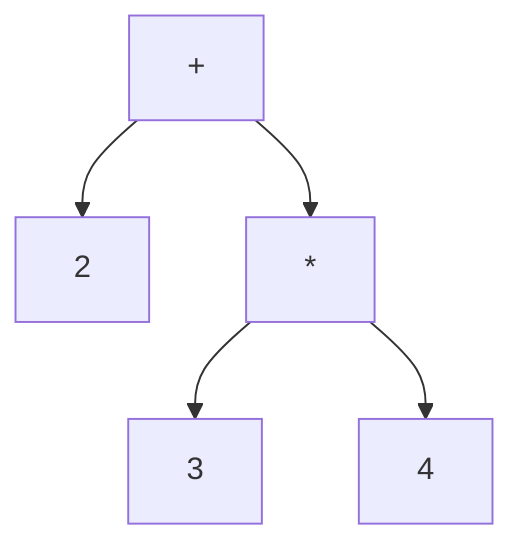

# 6. Syntax Analysis

[Contents](index.md) · [Русский](../ru/06-syntax-analysis.md) · [Previous chapter](05-lexical-analysis.md) · [Next chapter](07-ast-and-name-binding.md)

Edition 3. Implementation described: [commit cf51b8c, including `for`](https://github.com/kniazkov/g0at/tree/cf51b8cb27a102d15260c7822ce503404462b0fd).

<a id="section-6-1"></a>

## 6.1. From Adjacent Elements to Structure

The scanner distinguishes numbers, names, and operator symbols. A token sequence does not yet explain why `2 + 3 * 4` requires multiplication first. Syntax analysis (constructing program structure according to notation rules) establishes that relationship.

The parser receives a scanner, token groups, and arenas. It produces an AST root and a list of created functions for later code generation, or errors. Coordination lives in [parser.c](https://github.com/kniazkov/g0at/blob/cf51b8cb27a102d15260c7822ce503404462b0fd/src/parser/parser.c), with individual rules in `parsing_*.c` files.

This algorithm should not be imagined as a hidden grammar of an external tool. Its order is written directly in C: bracket grouping followed by passes over specified token groups. Reduction (replacing several adjacent elements with one composite element) gradually turns the sequence into a tree.

<a id="section-6-2"></a>

## 6.2. Brackets Establish Boundaries First

`process_brackets` obtains tokens through `get_token`. On an opening bracket, it recursively reads nested content up to the matching closing bracket. A `TOKEN_BRACKET_PAIR` replaces the pair and its interior sequence in the outer list, while `children` holds the contents.

In `2 * (3 + 4)`, the outer multiplication now has a single container on its right. That container retains its own list for `3 + 4`. A mismatched closing bracket, a closing bracket without an opening one, or end of file before closure produces an error at this stage.

A bracket pair is not yet an expression. `(...)` may contain function arguments, an `if` condition, a `catch` binding, or an expression with altered precedence. `{...}` may be a function body or a block expression. Subsequent passes identify its specific role from neighboring tokens.

Nested contents retain their operator-group membership. Later passes can therefore locate operations inside brackets too. [Parser tests](https://github.com/kniazkov/g0at/blob/cf51b8cb27a102d15260c7822ce503404462b0fd/src/test/test_parser.c) check this representation.

<a id="section-6-3"></a>

## 6.3. What One Reduction Does

A [binary-operation rule](https://github.com/kniazkov/g0at/blob/cf51b8cb27a102d15260c7822ce503404462b0fd/src/parser/parsing_binary_operations.c) checks that expression tokens appear on both sides of the operator. Their nodes are passed to an operation constructor, after which `collapse_tokens_to_token` replaces the entire segment with one `TOKEN_EXPRESSION` holding the new node.

For `2 + 3 * 4`, the multiplication group is processed first. The resulting `3 * 4` expression becomes the right operand of addition. Addition is then reduced. The final structure can be shown as follows:



The parser does not yet compute `14` for this operation. It records how the operations connect. Constant evaluation may happen later during analysis.

The new token receives a range from the start of the first reduced element to the end of the last. Old elements leave the lists but remain in arena memory until cleanup. Group traversal saves the next or previous element beforehand because a rule may change the current element's links.

<a id="section-6-4"></a>

## 6.4. Why Pass Order Matters

Precedence (which operation binds operands more strongly) and associativity (how a chain of operations at one level is grouped) are expressed through pass order and traversal direction.

The main `apply_reduction_rules` passes, with closely related steps combined, are:

| Stage | Action |
|---|---|
| `catch` headers | Protect the exception name from ordinary expression rules |
| Blocks and functions | Create container nodes; bodies will be filled later |
| Calls, parentheses, names | Create call and expression shells; remaining names become variable nodes |
| Updates | Traverse postfix `++`/`--` forward, prefix forms backward |
| Unary operations and power | Traverse backward; unary rules additionally handle binding to power |
| Multiplication, addition, shifts | Successive forward passes |
| Comparisons, equality | Process `<`, `<=`, `>`, `>=` before `==`, `!=` |
| Bitwise and logical operations | Process `&`, `^`, `\|`, `&&`, `\|\|` in order |
| Assignments | Traverse backward to construct the right side of a chain before the left |
| Arguments, declarations, returns, `throw` | Incorporate expressions into larger constructs |
| Control flow and container completion | Process `if`/`for`/`try`, remaining `else`/`catch`, then bodies and parenthesized expressions |

Direction is especially visible in `2 ** 3 ** 2`: exponentiation groups to the right as `2 ** (3 ** 2)`, producing `512.0`. Assignment `a = b = 5` is also constructed from the right: first `b = 5`, then assignment of its result to `a`. An ordinary subtraction chain uses left grouping.

The unary rule cannot be explained solely by its pass position in the table. [parsing_unary_operations.c](https://github.com/kniazkov/g0at/blob/cf51b8cb27a102d15260c7822ce503404462b0fd/src/parser/parsing_unary_operations.c) first reduces a power tail to the right of the operand. Thus `-2 ** 2` means `-(2 ** 2)`, while `2 ** -2` remains a valid negative exponent. Pass traversal and program evaluation order are different matters: the completed call's arguments are still evaluated from right to left, as described in Chapter 2.

[Grouping example](../examples/06-expressions.goat):

```goat
println(2 + 3 * 4);
println((2 + 3) * 4);
println(2 ** 3 ** 2);
println(-2 ** 2);
println(2 ** -2);
var a = 0;
var b = 0;
a = b = 5;
println(a + b);
```

Output:

```text
14
20
512.0
-4.0
0.25
10
```

To inspect the result, print reconstructed source with optimizations disabled. On Linux:

```sh
./goat --optimize none --print-source-code docs/book/examples/06-expressions.goat
```

In Windows PowerShell:

```powershell
.\goat.exe --optimize none --print-source-code .\docs\book\examples\06-expressions.goat
```

The command then executes the program, so the results follow the source listing. Reconstructed text shows the nodes' representation, not a byte-for-byte file copy: original whitespace and comments are not retained.

<a id="section-6-5"></a>

## 6.5. Why Incomplete Nodes Are Needed

The parser must be able to use a block or call as one expression before its interior is fully parsed. The [block and function rules](https://github.com/kniazkov/g0at/blob/cf51b8cb27a102d15260c7822ce503404462b0fd/src/parser/parsing_scopes_and_functions.c) therefore first create a node shell and retain body tokens in a separate group. The outer construct already sees an expression, while a later pass fills its statement list.

[Calls](https://github.com/kniazkov/g0at/blob/cf51b8cb27a102d15260c7822ce503404462b0fd/src/parser/parsing_function_calls.c) follow the same pattern: an identifier followed by parentheses becomes a call node, while its arguments are temporarily retained separately. Once operations have been reduced, each argument must be an expression, and commas must separate the arguments.

[Ordinary parentheses](https://github.com/kniazkov/g0at/blob/cf51b8cb27a102d15260c7822ce503404462b0fd/src/parser/parsing_parenthesized_expressions.c) receive a shell node; a final check requires exactly one expression inside. An `if` condition and a `catch` header have separate paths. Identical brackets therefore do not force a condition to be treated as a parameter list or a handler name as a call.

Declarations are processed after expressions. A variable's initializer (the expression supplying its initial value) is optional; a constant requires one. In `var x = 2 + 3`, addition is already a node at that stage. The assignment rule separately checks the left side: it must be an assignable expression, not a numeric literal, for example.

<a id="section-6-6"></a>

## 6.6. Conditions, Handlers, and Statement Lists

The [`if` rule](https://github.com/kniazkov/g0at/blob/cf51b8cb27a102d15260c7822ce503404462b0fd/src/parser/parsing_flow_keywords.c) requires parentheses containing one condition expression and a following statement or expression. An expression used as a statement receives a wrapper node. An optional `else` is attached while parsing the construct; the pass traverses its group backward so nested constructs can be assembled before their enclosing ones. Any unmatched `else` becomes an error.

[`try/catch`](https://github.com/kniazkov/g0at/blob/cf51b8cb27a102d15260c7822ce503404462b0fd/src/parser/parsing_exceptions.c) has a preliminary step: `catch` must contain exactly one identifier in parentheses. That identifier leaves the ordinary name group. The main step requires a `try` body and a handler block; a single `try` statement additionally receives a container that allows implicit local declarations to be inserted later. `throw` requires an expression for the value being passed. A `catch` left without a `try` is also rejected.

Finally, `process_statement_list` collects a list: completed statements are added directly, expressions receive statement-expression wrappers, and commas and semicolons are skipped. Any remaining element of an unsuitable kind means parsing failed. The outer list becomes the root node.

This explains why some examples permit omitted semicolons: reductions have already established their boundaries. There is no separate rule saying that a newline always ends a statement. For predictable notation, the book's examples use explicit separators and blocks for branches.

The [`for` rule](https://github.com/kniazkov/g0at/blob/cf51b8cb27a102d15260c7822ce503404462b0fd/src/parser/parsing_for.c) keeps header parentheses separate from ordinary parenthesized expressions. After reducing expressions and declarations, it requires exactly two semicolons and validates three optional slots. Backward control-flow reduction first builds an inner `for` or `if`, then attaches it as the outer body. A body without braces is wrapped in a statement list, providing a per-iteration scope. Unmatched `else` diagnostics run after enclosing constructs have had a chance to consume the keyword.

<a id="section-6-7"></a>

## 6.7. What the Parser Does Not Promise

> [!CAUTION]
> A word in a C comment or an item in a low-level structure does not establish syntax support. The keyword table and active rules implement `for`, but not `while` or `do/while`. Recognizing square brackets does not implement arrays. The call rule is built around an identifier and parentheses: it does not support a chain such as `f()()`; a returned function can first be stored in a variable and then called.

> [!CAUTION]
> Errors accumulate in compilation structures; a critical error stops the current pass sequence. This is not a recovery system guaranteed to continue parsing after arbitrary source damage. Diagnostic completeness is further limited by the cases described in Chapter 5.

Besides [bracket tests](https://github.com/kniazkov/g0at/blob/cf51b8cb27a102d15260c7822ce503404462b0fd/src/test/test_parser.c), useful checks include [exception-parser tests](https://github.com/kniazkov/g0at/blob/cf51b8cb27a102d15260c7822ce503404462b0fd/src/test/test_exception_parser.c), the [unary-precedence example](https://github.com/kniazkov/g0at/blob/cf51b8cb27a102d15260c7822ce503404462b0fd/test/functional/unary_precedence/program.goat), and [a missing parameter comma](https://github.com/kniazkov/g0at/blob/cf51b8cb27a102d15260c7822ce503404462b0fd/test/functional/no_comma_bw_func_args/program.goat). They check specific algorithm paths. Successful parsing yields program structure; name meanings and computation properties still require later stages.
