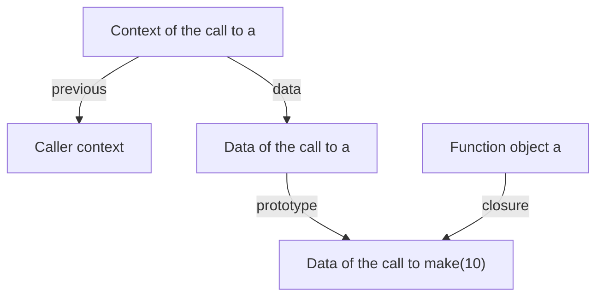

# 10. Contexts, Functions, and Closures

[Contents](index.md) · [Русский](../ru/10-contexts-and-closures.md) · [Previous chapter](09-vm-and-values.md) · [Next chapter](11-memory-management.md)

Revision 2. Implementation described: [commit 8d1fe86, including `println`](https://github.com/kniazkov/g0at/tree/8d1fe867ff5272d8d59a44785871f0db1b454df0).

<a id="section-10-1"></a>

## 10.1. Scope becomes data

In chapter 7, a scope connected a name to an AST declaration. Execution needs to store concrete values instead. This is the role of `context_t` in [context.h](https://github.com/kniazkov/g0at/blob/8d1fe867ff5272d8d59a44785871f0db1b454df0/src/model/context.h): a data object, a link to the previous context, and fields controlling returns or exceptions.

`create_context` creates a new user-defined object. Its prototype is either an explicitly supplied environment or the caller context's data. Declarations create own properties on this object. A nested block can therefore see outer names, while its own declaration can shadow one of them.

There are two distinct links: `previous` leads backward through execution, while data prototypes determine name lookup. For an ordinary block they agree. For a closure call they may lead to different environments. Confusing them would silently replace lexical scope with dynamic scope, where a name depended on the call site.

<a id="section-10-2"></a>

## 10.2. What a function retains

At `FUNC`, the VM creates a dynamic function object. It stores the first body instruction's address, formal parameter names, a reference to the current context's data, and an optional descriptor of native specializations. Reference counting retains the data reference. The implementation is in [function.c](https://github.com/kniazkov/g0at/blob/8d1fe867ff5272d8d59a44785871f0db1b454df0/src/model/function.c).

A closure is a function together with its saved lexical environment. Goat retains the environment object, rather than a snapshot of individual values or a pointer to a temporary C context structure. A write to an outer variable is therefore visible to later calls of the same function. Separate calls of a factory function create separate environments.

The bytecode body can still be shared. In the example below, both counter functions execute the same instructions but read different objects holding `value`.

The diagram shows these links while calling `a` in the example below. The execution context stores the return path, while the call's data object inherits the function's environment.



<a id="section-10-3"></a>

## 10.3. How a call proceeds

`CALL` takes the function object from the stack and invokes its `call` method. For a built-in, this directly calls its C executor. For a dynamic function, a suitable native specialization may be selected first; part V examines that path. Ordinary bytecode execution performs these steps:

1. Create a call context. Its `previous` points to the caller context, while its data prototype points to the function's saved environment.
2. Mark the context `FLOW_RETURN` and save the address of the instruction after `CALL`.
3. Pop actual arguments from the stack and bind them to formal parameters in order.
4. Bind missing arguments to `null`. Extra arguments have already been evaluated, but receive no parameter names and are released.
5. Reserve a result slot on the stack, initially containing `null`, and transfer execution to the first body instruction.

Argument evaluation remains right to left. Binding arguments to parameters proceeds left to right. The stack provides this distinction; names in the source are not reordered.

<a id="section-10-4"></a>

## 10.4. Returning through nested blocks

`RET` pops the return value and writes it into the reserved slot. The VM then destroys contexts up to the current call boundary, reduces the stack to the result, and restores the continuation address and caller context. A `return` inside several blocks therefore returns from the function, rather than just leaving the nearest block.

Ordinary block completion differs: `LEAVE` retains the block's data object, destroys the context wrapper, and pushes the object. `RESTORE` only removes the context. These instructions are not interchangeable: they have different stack effects.

Destroying a context decrements its data's reference count. It need not destroy that data immediately. If a function retains the environment, the values remain available after the call that created them returns.

<a id="section-10-5"></a>

## 10.5. Independent states and recursion

File [10-closures.goat](../examples/10-closures.goat):

```goat
const make = func(start) {
    var value = start;
    return func() { value = value + 1; return value; };
};
const a = make(10);
const b = make(20);
println(a());
println(a());
println(b());
const first = func(x) { return x; };
println(first());
println(first(7, 8));
const factorial = func(n) {
    if (n <= 1) { return 1; }
    return n * factorial(n - 1);
};
println(factorial(5));
```

Result:

```text
11
12
21
null
7
120
```

`a` and `b` retain data from different calls to `make`. Two calls to `a` modify one variable, while `b` starts from its own value. `first` demonstrates that a user function does not check for an exact argument count: a missing argument becomes `null`, and an extra one is unused.

The recursive `factorial` finds its own name through the environment. Each call creates a new context with its own `n` and return address. An environment may retain a function that retains that same environment, creating a reference cycle. Chapter 11 examines its memory consequences.

> [!CAUTION]
> Bytecode calls do not perform tail-call optimization: each such call creates another context. The current executor has no general user mechanism limiting VM recursion depth; context and stack growth are bounded by available memory. Native-path protective limits are a separate mechanism.

<a id="section-10-6"></a>

## 10.6. Processes and threads in this implementation

[process.c](https://github.com/kniazkov/g0at/blob/8d1fe867ff5272d8d59a44785871f0db1b454df0/src/model/process.c) creates a process with an identifier, object lists, and one main thread. [thread.c](https://github.com/kniazkov/g0at/blob/8d1fe867ff5272d8d59a44785871f0db1b454df0/src/model/thread.c) creates a thread with a current context, stack, instruction index, auxiliary operands, and exception state. The thread also holds native-attempt counters.

Thread links form a circular list. After an instruction, the VM loop selects `thread->next`. With one thread, this is the same thread again. These are the internal structures through which execution and garbage collection operate.

> [!CAUTION]
> This version of the language has no user facilities for creating threads or synchronizing them. A circular list and a pointer switch in the VM do not implement parallel execution of a user program on multiple cores.

Here, “process” also denotes a Goat runtime structure, rather than an automatically created separate operating-system process. These names should be read according to their actual role in the code.

<a id="section-10-7"></a>

## 10.7. What outlives a call

After a return, the context wrapper and temporary call values are no longer needed. However, the returned object, captured environment, and data reachable through them may live on. This is not an exceptional case; it is the basis of ordinary closure behavior.

It helps to ask two separate questions: where `RET` returns control, and who retains the data afterward. Contexts and addresses determine the first; object references determine the second. The next chapter describes that second side, including cases where reference counts cannot release an environment on their own.
