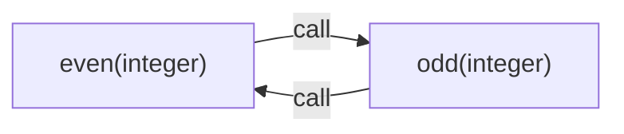

# 18. Call Graph and Recursion

[Contents](index.md) · [Русский](../ru/18-call-graph-and-recursion.md) · [Previous chapter](17-call-analysis-and-specializations.md) · [Next chapter](19-effects-and-purity.md)

Revision 3. Implementation described: [commit cf51b8c, including `for`](https://github.com/kniazkov/g0at/tree/cf51b8cb27a102d15260c7822ce503404462b0fd).

<a id="section-18-1"></a>

## 18.1. A dependency instead of endless traversal

For a recursive function, a call's result depends on another call to the same function. If the analyzer simply substitutes a body for every call, traversal may never end. Goat separates dependency discovery from return-type computation.

A call graph is a set of vertices and directed edges. Here, a vertex represents a specialization: a function body together with parameter types. An edge says that one specialization may call another at a particular site. This is neither a log of executed calls nor one run's stack tree.

One body with `(integer)` and `(real)` signatures may therefore occupy two vertices. A thousand executions of one call need no thousand edges: equal observations about a site and target are merged.

<a id="section-18-2"></a>

## 18.2. Discovering targets

[function_call_graph.c](https://github.com/kniazkov/g0at/blob/cf51b8cb27a102d15260c7822ce503404462b0fd/src/analysis/function_call_graph.c) first creates vertices for registered signatures. It then inspects their bodies using type-level parameters. Newly discovered signatures are appended; the list also acts as a work queue.

A known function value directly identifies its body. Without one, the analyzer tries to resolve an immutable reference: through parentheses and `const` declarations to a function node. This finds direct and mutual calls without relying on one run's incidental state.

> [!CAUTION]
> Reference resolution is limited to 64 steps and does not treat a mutable variable as a constant target. The graph is limited to 1024 vertices. Unknown targets and exhausted limits have separate edge kinds; failing to find a target does not mean no call exists. A truncated graph must not be used as a complete basis for later proofs.

A vertex carries a completeness flag. An unresolved callee, for example, makes it incomplete. The known graph portion remains useful diagnostically, but does not justify forgetting unknown dependencies.

<a id="section-18-3"></a>

## 18.3. Strongly connected components

A strongly connected component is a group where every vertex can reach every other along directed edges. One vertex with a self-edge represents direct recursion. Two functions calling each other form a mutually recursive component.

Goat uses Tarjan's algorithm: traversal stores a visitation index, the lowest reachable active index (`lowlink`), and a stack of vertices not yet assigned to components. At a component boundary, the corresponding stack portion is removed and assigned a group number.

The useful result is knowing which types must be reconciled together. A component number is a traversal identifier, rather than function priority. Unknown targets do not become invented vertices with proven behavior.

<a id="section-18-4"></a>

## 18.4. Initial approximation and fixed point

[function_return.c](https://github.com/kniazkov/g0at/blob/cf51b8cb27a102d15260c7822ce503404462b0fd/src/analysis/function_return.c) solves a recursive group iteratively. Each member initially has return type `BOTTOM`. This is an initial absence of known normal returns, rather than a claim that the function is broken.

The body is analyzed with general parameter types. A recursive call uses the current return-type approximation of its target specialization. The new result joins the previous one and is normalized to a type. Possible-result information may expand, but an established type is not discarded for a narrower guess.

If another full pass changes no types, a fixed point has been reached: applying these rules again gives the same result. This concerns the abstract model. It does not prove program termination.

The group is additionally expanded with all signatures of participating bodies and their recursive components. Solving therefore accounts for more than one edge with a matching key. Signature lookup first prefers an exact type match, then an eligible broader existing description.

<a id="section-18-5"></a>

## 18.5. Direct recursion in an example

File [18-recursion.goat](../examples/18-recursion.goat):

```goat
const factorial = func(n) {
    if (n <= 1) { return 1; }
    return n * factorial(n - 1);
};
println(factorial(5));
```

Result:

```text
120
```

For `(integer)`, `n <= 1` is unknown in advance. The base branch returns an integer. Initially, the recursive branch uses `BOTTOM`; once an integer approximation appears, the product also has integer type. A subsequent stable pass confirms `integer`.

Analysis does not compute factorials for every 64-bit integer. It solves a type equation over a finite set of descriptions. Large-argument result overflow follows Goat's integer semantics and does not itself promote the type to real.

<a id="section-18-6"></a>

## 18.6. Mutual recursion

File [18-mutual.goat](../examples/18-mutual.goat):

```goat
const even = func(n) {
    if (n == 0) { return 1; }
    return odd(n - 1);
};
const odd = func(n) {
    if (n == 0) { return 0; }
    return even(n - 1);
};
println(even(6));
```

It prints `1`. Its integer signatures have this known dependency:



Both vertices belong to one recursive group of size 2. In this example, the log reports `iterations=2`, return type `integer`, and `c=supported` for both. The iteration count counts summary evaluations during solving, rather than runtime calls.

These examples deliberately use separate files: ordinary analysis may forget current bindings after a recursive call, so subsequent calls in that file need not supply the same initial signatures. This concerns fact discovery, rather than changes to program results.

<a id="section-18-7"></a>

## 18.7. When solving is insufficient

> [!CAUTION]
> Recursive type solving is limited to 64 passes. On exhaustion, the group receives `inconclusive` and `TOP`; intermediate approximations are not published as completed proofs. An unknown target or one outside the solved group may also leave analysis incomplete. This solver does not run on a truncated graph.

Calls account for possible environment changes: a self-call forgets captures, while a call to another body uses broader forgetting. This reduces precision but prevents retaining a false constant that a closure can modify.

Even stable `BOTTOM` means no normal result in the model, rather than a proven exception text. [test_function_call_graph.c](https://github.com/kniazkov/g0at/blob/cf51b8cb27a102d15260c7822ce503404462b0fd/src/test/test_function_call_graph.c) and [test_function_return.c](https://github.com/kniazkov/g0at/blob/cf51b8cb27a102d15260c7822ce503404462b0fd/src/test/test_function_return.c) check graph and recursive types. After types, the analyzer still needs to establish what the function can change outside itself.
