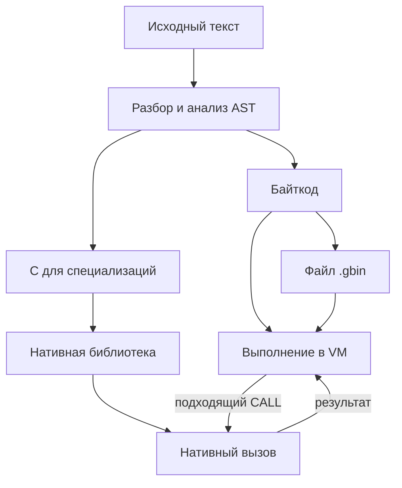

# 3. Путь программы через систему

[Оглавление](index.md) · [English](../en/03-program-pipeline.md) · [Предыдущая глава](02-implemented-language.md)

Редакция 2. Описываемая реализация: [commit 8d1fe86, с функцией `println`](https://github.com/kniazkov/g0at/tree/8d1fe867ff5272d8d59a44785871f0db1b454df0).

<a id="section-3-1"></a>

## 3.1. Программа для наблюдения

Результат программы легко увидеть на экране. Значительно менее очевидно, какие представления она успела сменить до этого момента. Проследим путь маленькой функции: она возвращает ноль для отрицательного аргумента, а в остальных случаях прибавляет единицу по правилам целой арифметики Goat.

[Исходник примера](../examples/03-pipeline.goat):

```goat
const step = func(x) {
    if (x < 0) { return 0; }
    return x + 1;
};
println(step(4));
```

Программа выводит `5` и перевод строки. В ней есть объявление, параметр, условие, два возврата, арифметика и вызовы. Этого достаточно, чтобы увидеть основные этапы, не отвлекаясь на большой алгоритм.

Для опытов скопируем исходник в рабочий каталог. Дальнейшие команды выполняются из корня репозитория после сборки Goat. На Linux:

```sh
mkdir -p build/book
cp docs/book/examples/03-pipeline.goat build/book/pipeline.goat
./goat --native off --save-analysis build/book/analysis.txt build/book/pipeline.goat
```

В Windows PowerShell:

```powershell
New-Item -ItemType Directory -Force .\build\book | Out-Null
Copy-Item .\docs\book\examples\03-pipeline.goat .\build\book\pipeline.goat
.\goat.exe --native off --save-analysis .\build\book\analysis.txt .\build\book\pipeline.goat
```

На экране появится результат, а в `analysis.txt` — сведения анализатора. Генерируемые файлы далее также будут находиться в `build/book`.

<a id="section-3-2"></a>

## 3.2. Текст становится деревом

[Модуль запуска](https://github.com/kniazkov/g0at/blob/8d1fe867ff5272d8d59a44785871f0db1b454df0/src/cli/launcher.c) читает исходный файл как UTF-8 (кодировку, позволяющую хранить текст разных языков). Для дальнейшей обработки текст переводится во внутреннее представление широких символов C. Сканер (механизм распознавания элементов записи) выделяет токены: имена, числа, ключевые слова, скобки и операторы, сохраняя их координаты в исходнике.

Например, в `x + 1` распознаются имя `x`, знак `+` и целое число `1`. Пока это ещё не команда сложить значения. Синтаксический анализ должен установить, что эти элементы образуют одно выражение и как оно связано с `return`.

В Goat [разбор](https://github.com/kniazkov/g0at/blob/8d1fe867ff5272d8d59a44785871f0db1b454df0/src/parser/parser.c) сначала группирует скобки, затем применяет правила свёртки (замены подходящей последовательности элементов одним более крупным элементом). Правила учитывают приоритеты операций и конструкции языка. Результат — AST, абстрактное синтаксическое дерево (структура, описывающая смысловые части записи без необходимости хранить каждую исходную скобку и разделитель).

В нашем примере узел функции содержит список параметров и тело. В теле находятся условие и возврат `x + 1`; условие содержит сравнение `x < 0` и ветвь с возвратом нуля. Это описание структуры, а не последовательность машинных команд. Например, узел ветви может существовать в дереве, даже если для отдельного вызова эта ветвь не будет выбрана.

Токены нужны для построения дерева; после разбора модуль запуска освобождает выделенную для них память. Узлы дерева живут дольше: ими ещё воспользуются анализатор и генераторы кода.

<a id="section-3-3"></a>

## 3.3. Имена получают смысл, значения — описание

Дерево содержит несколько употреблений имени `x`. Нужно установить, что они относятся к параметру `step`, а `step` в вызове относится к объявленной константе. Связывание имён (соединение употребления имени с конкретным объявлением) выполняется в [анализаторе](https://github.com/kniazkov/g0at/blob/8d1fe867ff5272d8d59a44785871f0db1b454df0/src/analysis/analysis.c). Он назначает узлам области видимости и идентификаторы, разрешает имена, а затем приступает к вычислению сведений о программе.

Этот порядок важен. Чтобы рассуждать о значении переменной, сначала надо понять, о какой переменной идёт речь. Связывание выполняется даже с `--optimize none`, когда необязательный анализ и преобразования отключены.

При анализе вызова `step(4)` известно конкретное значение аргумента. Однако для подготовки нативной функции требуется более общее описание. Специализация (реализация функции для определённого упорядоченного набора типов параметров) в данном случае имеет один целый параметр. Она должна быть корректна и для других целых чисел, включая отрицательные и граничные значения.

Здесь используются абстрактные значения (описания возможных значений, например «ровно 4», «целое число» или «значение неизвестно»). Анализатор вычисляет такие описания вместо обычного исполнения всех возможных входов. Для нашего примера в отчёте есть запись о конкретном вызове:

```text
#2 pipeline.goat, 1.14: write x = 4
```

А строка `function-summary` содержит сведения о целой специализации; среди её полей:

```text
(integer) -> integer effects=none c=supported purity=pure
```

Это означает: параметр и результат целые, анализ не обнаружил учитываемых эффектов, чистота доказана, генерация C поддержана. `write x = 4` и сводка `(integer) -> integer` отвечают на разные вопросы. Нельзя взять сведения об одном положительном аргументе и на их основании удалить отрицательную ветвь из реализации для всех целых.

Помимо значений, анализатор рассматривает вызовы, рекурсию и эффекты, проверяет допустимость генерации C, отмечает недостижимые участки и упрощает дерево. Журнал анализа фиксирует наблюдения разных этапов; он не является трассой фактически выполненных инструкций. Подробный смысл этих этапов будет разобран в части IV.

<a id="section-3-4"></a>

## 3.4. Дерево превращается в инструкции VM

Генератор байткода обходит дерево и формирует инструкции виртуальной машины. Байткод (код в системе инструкций Goat) хранит порядок действий явно: загрузить значение, сравнить, перейти, вызвать функцию, вернуть результат. Отдельно накапливаются данные, например имена и строки; [компоновщик](https://github.com/kniazkov/g0at/blob/8d1fe867ff5272d8d59a44785871f0db1b454df0/src/codegen/linker.c) объединяет подготовленные код и данные.

Тела функций генерируются отложенно: сначала создаётся код окружающей программы, затем размещается код функций и уточняются нужные адреса. Поэтому создание функции не означает немедленного исполнения её тела.

Посмотрим байткод без необязательных преобразований. На Linux:

```sh
./goat --optimize none --native off --print-bytecode build/book/pipeline.goat
```

В Windows PowerShell:

```powershell
.\goat.exe --optimize none --native off --print-bytecode .\build\book\pipeline.goat
```

Команда печатает листинг (текстовое представление инструкций), а затем запускает программу. В нём можно найти следующую последовательность; здесь показаны только инструкции вычисления `println(step(4))`, без числовых индексов строковых данных:

| Инструкция | Действие |
|---|---|
| `ILOAD32 4` | Поместить целое `4` на стек значений |
| `VLOAD "step"` | Найти функцию `step` и поместить её на стек |
| `CALL 1` | Вызвать её с одним аргументом; получить результат |
| `VLOAD "println"` | Найти функцию `println` |
| `CALL 1` | Передать ей результат `step` |
| `POP` | Удалить неиспользуемый результат вызова `println` |

Стек (хранилище, из которого последним извлекается последнее добавленное значение) помогает передавать промежуточные результаты между инструкциями. В теле `step` видны загрузки `x` и `0`, сравнение `LESS` и условный переход `JIF`. Выбранный путь заканчивается `RET`, возвращающим результат.

[VM](https://github.com/kniazkov/g0at/blob/8d1fe867ff5272d8d59a44785871f0db1b454df0/src/vm/vm.c) читает эти инструкции и вызывает операции объектов исполнительной среды. Результат сложения становится объектом целого числа, а `println` превращает полученное значение в вывод. К началу обычного исполнения модуль запуска уже освобождает дерево и исходный текст: VM работает с подготовленным байткодом.

<a id="section-3-5"></a>

## 3.5. Ответвление к машинному коду

Для поддерживаемой специализации из того же проанализированного дерева можно получить C. Это ещё один результат подготовки программы. Сначала посмотрим его, затем запустим программу с нативным исполнением (выполнением сгенерированных машинных инструкций процессором).

На Linux:

```sh
./goat --save-c build/book/pipeline.goat
./goat --native required --save-native build/book/native.txt build/book/pipeline.goat
```

В Windows PowerShell:

```powershell
.\goat.exe --save-c .\build\book\pipeline.goat
.\goat.exe --native required --save-native .\build\book\native.txt .\build\book\pipeline.goat
```

Первая команда сохраняет `pipeline.c` и не исполняет программу. Вторая сама выполняет необходимую подготовку; предварительное сохранение C ей не требуется. Для неё нужен внешний компилятор C: по умолчанию `cc` на Linux и `gcc` на Windows, с возможностью выбора через переменную окружения `CC`.

[Нативный конвейер](https://github.com/kniazkov/g0at/blob/8d1fe867ff5272d8d59a44785871f0db1b454df0/src/codegen/native_pipeline.c) формирует C-модуль, компилирует динамическую библиотеку, загружает её и проверяет интерфейс. Между VM и машинной функцией используется ABI (соглашение о представлении данных и способе вызова). Подходящая специализация связывается с объектом функции Goat.

Окружающая программа продолжает исполняться в VM. Когда VM доходит до `CALL`, [объект функции](https://github.com/kniazkov/g0at/blob/8d1fe867ff5272d8d59a44785871f0db1b454df0/src/model/function.c) проверяет возможность нативного вызова с фактическими аргументами. В нашем примере тело `step` выполняется машинным кодом, а внешний вызов `println` остаётся частью обычного пути исполнения.

В `native.txt` ожидаются, в частности:

```text
preparation=ready
bound=1
succeeded=1
retries=0
```

Подготовлена библиотека, привязана одна функция, один вход завершился нативно, повтор в VM не потребовался. Наличие `pipeline.c` само по себе не подтверждает нативного исполнения; это подтверждают счётчики запуска.

Режим `off` отключает этот путь. `auto` допускает продолжение в VM, если подготовка нативной реализации не удалась. `required` требует успешной подготовки хотя бы одной привязанной функции; он не означает перевод всей программы в машинный код и не отменяет предусмотренный возврат к VM при ограничениях ресурсов. Правила режимов находятся в [модуле нативного запуска](https://github.com/kniazkov/g0at/blob/8d1fe867ff5272d8d59a44785871f0db1b454df0/src/cli/native_execution.c).

<a id="section-3-6"></a>

## 3.6. Подготовить сегодня, исполнить отдельно

До сих пор каждый запуск начинался с исходника. Раздельная компиляция (сохранение подготовленной программы для последующего отдельного запуска) позволяет не повторять чтение текста, разбор и анализ.

На Linux:

```sh
./goat --compile --native off build/book/pipeline.goat
./goat --run --native off build/book/pipeline.gbin
./goat --compile --native required build/book/pipeline.goat
./goat --run --native required --save-native build/book/saved-native.txt build/book/pipeline.gbin
```

В Windows PowerShell:

```powershell
.\goat.exe --compile --native off .\build\book\pipeline.goat
.\goat.exe --run --native off .\build\book\pipeline.gbin
.\goat.exe --compile --native required .\build\book\pipeline.goat
.\goat.exe --run --native required --save-native .\build\book\saved-native.txt .\build\book\pipeline.gbin
```

Первая команда сохраняет байткод в `pipeline.gbin`, вторая исполняет его и выводит `5`. Третья заново сохраняет `pipeline.gbin`, теперь вместе со связью с нативной библиотекой: рядом появляется `pipeline.so` на Linux или `pipeline.dll` на Windows. Четвёртая загружает эту пару и тоже выводит `5`. Команды с `--compile` пользовательскую программу не исполняют.

Для отдельного запуска исходный `.goat` и компилятор C уже не нужны. Сам исполнитель Goat и, для нативного варианта, совместимая библиотека нужны по-прежнему. `.gbin` не является самостоятельным исполняемым файлом операционной системы и не обещает переносимость между произвольными платформами или версиями.

[Загрузка подготовленной программы](https://github.com/kniazkov/g0at/blob/8d1fe867ff5272d8d59a44785871f0db1b454df0/src/cli/binary_program.c) идёт отдельным путём: проверяет бинарный формат и, при использовании нативного режима, соответствующую библиотеку, затем передаёт байткод VM. Контроль целостности помогает обнаружить повреждение или несоответствие файлов; он не делает чужой машинный код безопасным для запуска.

<a id="section-3-7"></a>

## 3.7. Где расходятся пути

Теперь основные развилки можно показать вместе. Схема описывает зависимости между результатами подготовки; детали вызова компилятора и загрузки здесь опущены.



При сохранении нативного варианта `.gbin` также содержит сведения для привязки соответствующей библиотеки. При отдельном запуске эти сведения восстанавливают связь, которую при запуске исходника создавал нативный конвейер.

Разные сбои относятся к разным этапам. Непарная скобка мешает получить дерево. Неподдерживаемая для C функция может оставаться корректной для VM. Ошибка внешнего компилятора не равнозначна синтаксической ошибке Goat. Исключение при исполнении возникает уже после подготовки программы. Поэтому сообщения, отчёт анализа и отчёт нативного исполнения следует читать с учётом того, на каком участке они появились.

В следующих частях эти крупные шаги будут разобраны изнутри. У каждого из них уже есть конкретный вход, наблюдаемый результат и место в работающем примере: текст, дерево, сведения анализа, байткод, библиотека или сохранённый файл программы.
