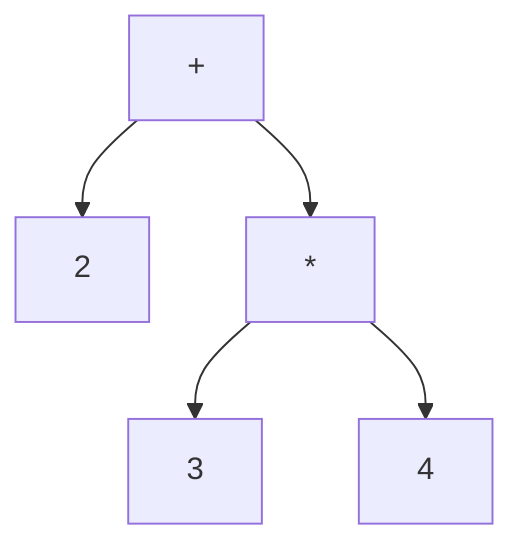

# 6. Синтаксический анализ

[Оглавление](index.md) · [English](../en/06-syntax-analysis.md) · [Предыдущая глава](05-lexical-analysis.md) · [Следующая глава](07-ast-and-name-binding.md)

Редакция 3. Описываемая реализация: [commit cf51b8c, с оператором `for`](https://github.com/kniazkov/g0at/tree/cf51b8cb27a102d15260c7822ce503404462b0fd).

<a id="section-6-1"></a>

## 6.1. Из соседства элементов — в структуру

Сканер отличает числа от имён и знаков операций. Но последовательность токенов ещё не объясняет, почему в `2 + 3 * 4` сначала требуется умножение. Эту связь задаёт синтаксический анализ (построение структуры программы по правилам её записи).

На входе парсера — сканер, группы токенов и арены. На выходе — корневой узел AST, список созданных функций для дальнейшей генерации кода либо ошибки. Координация находится в [parser.c](https://github.com/kniazkov/g0at/blob/cf51b8cb27a102d15260c7822ce503404462b0fd/src/parser/parser.c), отдельные правила — в файлах `parsing_*.c`.

Алгоритм здесь не следует представлять как скрытую грамматику стороннего инструмента. Его порядок непосредственно записан в C: группировка скобок, затем проходы по определённым группам токенов. Свёртка (замена нескольких соседних элементов одним составным элементом) постепенно превращает последовательность в дерево.

<a id="section-6-2"></a>

## 6.2. Сначала скобки задают границы

`process_brackets` получает токены через `get_token`. При открывающей скобке он рекурсивно читает вложенное содержимое до соответствующей закрывающей. Вместо пары и её внутренней последовательности во внешнем списке появляется `TOKEN_BRACKET_PAIR`, а содержимое хранится в `children`.

Для `2 * (3 + 4)` у внешнего умножения справа теперь один контейнер. Внутри него остаётся собственный список для `3 + 4`. Несовпадающая закрывающая скобка, закрывающая без открывающей и конец файла до закрытия дают ошибки на этом этапе.

Скобочная пара пока не равна выражению. `(...)` может содержать аргументы функции, условие `if`, имя обработчика `catch` или выражение с изменённым приоритетом. `{...}` может быть телом функции или блоком-выражением. Следующие проходы устанавливают конкретную роль по соседним токенам.

Вложенное содержимое одновременно сохраняет принадлежность к группам операторов. Поэтому последующие проходы могут находить операции и внутри скобок. Проверки такого представления есть в [тестах парсера](https://github.com/kniazkov/g0at/blob/cf51b8cb27a102d15260c7822ce503404462b0fd/src/test/test_parser.c).

<a id="section-6-3"></a>

## 6.3. Что делает одна свёртка

В [правиле бинарной операции](https://github.com/kniazkov/g0at/blob/cf51b8cb27a102d15260c7822ce503404462b0fd/src/parser/parsing_binary_operations.c) проверяется, что слева и справа от оператора стоят токены-выражения. Их узлы передаются конструктору операции, после чего `collapse_tokens_to_token` заменяет весь участок одним `TOKEN_EXPRESSION` с новым узлом.

Для `2 + 3 * 4` сначала обрабатывается группа умножения. Получается выражение `3 * 4`, которое становится правым операндом сложения. Затем сворачивается сложение. Итоговую структуру можно представить так:



Никакого результата `14` парсер для этой операции ещё не вычисляет. Он сохраняет связь операций. Вычисление константы может произойти позже, во время анализа.

Новый токен получает диапазон от начала первого сворачиваемого элемента до конца последнего. Старые элементы исключаются из списков, но остаются в памяти арены до её освобождения. Обход группы заранее запоминает следующий или предыдущий элемент, поскольку применяемое правило может изменить связи текущего.

<a id="section-6-4"></a>

## 6.4. Почему важен порядок проходов

Приоритет (какая операция сильнее связывает операнды) и ассоциативность (как группируется цепочка операций одного уровня) выражены последовательностью проходов и направлением обхода.

Основные проходы `apply_reduction_rules`, с объединением близких шагов:

| Этап | Что происходит |
|---|---|
| Заголовки `catch` | Имя исключения защищается от обычных правил выражений |
| Блоки и функции | Создаются узлы-контейнеры; тела заполнятся позже |
| Вызовы, круглые скобки, имена | Создаются оболочки вызовов и выражений, оставшиеся имена становятся узлами переменных |
| Обновления | Постфиксные `++`/`--` обходятся вперёд, префиксные — назад |
| Унарные операции и степень | Обход назад; связь со степенью дополнительно обрабатывается внутри унарного правила |
| Умножение, сложение, сдвиги | Последовательные проходы вперёд |
| Сравнения, равенство | Сначала `<`, `<=`, `>`, `>=`, затем `==`, `!=` |
| Побитовые и логические операции | По очереди `&`, `^`, `\|`, `&&`, `\|\|` |
| Присваивания | Обход назад, чтобы построить правую часть цепочки раньше левой |
| Аргументы, объявления, возвраты, `throw` | Выражения включаются в более крупные конструкции |
| Управление и завершение контейнеров | Обрабатываются `if`/`for`/`try`, оставшиеся `else`/`catch`, затем тела и выражения в скобках |

Направление особенно заметно в `2 ** 3 ** 2`: степень группируется справа, как `2 ** (3 ** 2)`, и даёт `512.0`. Присваивание `a = b = 5` также строится справа: сначала `b = 5`, затем присваивание его результата `a`. Для обычной цепочки вычитаний используется левая группировка.

Унарное правило нельзя объяснить только положением его прохода в таблице. [parsing_unary_operations.c](https://github.com/kniazkov/g0at/blob/cf51b8cb27a102d15260c7822ce503404462b0fd/src/parser/parsing_unary_operations.c) сначала сворачивает хвост степеней справа от операнда. Поэтому `-2 ** 2` означает `-(2 ** 2)`, а `2 ** -2` остаётся допустимой записью отрицательного показателя. Обход проходов и порядок исполнения программы — разные вещи: аргументы готового вызова по-прежнему вычисляются справа налево, как описано в главе 2.

[Пример группировки](../examples/06-expressions.goat):

```goat
println(2 + 3 * 4);
println((2 + 3) * 4);
println(2 ** 3 ** 2);
println(-2 ** 2);
println(2 ** -2);
var a = 0;
var b = 0;
a = b = 5;
println(a + b);
```

Результат:

```text
14
20
512.0
-4.0
0.25
10
```

Для наблюдения можно вывести восстановленный исходник без оптимизаций. На Linux:

```sh
./goat --optimize none --print-source-code docs/book/examples/06-expressions.goat
```

В Windows PowerShell:

```powershell
.\goat.exe --optimize none --print-source-code .\docs\book\examples\06-expressions.goat
```

Команда затем исполняет программу, поэтому после исходника появятся и результаты. Восстановленный текст показывает представление узлов, а не побайтовую копию файла: исходные пробелы и комментарии не сохраняются.

<a id="section-6-5"></a>

## 6.5. Зачем нужны незаполненные узлы

Парсер должен уметь использовать блок или вызов как единое выражение до того, как завершён разбор его внутренностей. Поэтому [правила блоков и функций](https://github.com/kniazkov/g0at/blob/cf51b8cb27a102d15260c7822ce503404462b0fd/src/parser/parsing_scopes_and_functions.c) сначала создают оболочку узла и сохраняют токены тела в отдельной группе. Внешняя конструкция уже видит выражение, а поздний проход заполняет его список инструкций.

Так же устроены [вызовы](https://github.com/kniazkov/g0at/blob/cf51b8cb27a102d15260c7822ce503404462b0fd/src/parser/parsing_function_calls.c): идентификатор с последующей парой круглых скобок заменяется узлом вызова, а список аргументов временно хранится отдельно. После свёртки операций каждый аргумент должен быть выражением, а между аргументами должны стоять запятые.

[Обычные круглые скобки](https://github.com/kniazkov/g0at/blob/cf51b8cb27a102d15260c7822ce503404462b0fd/src/parser/parsing_parenthesized_expressions.c) получают узел-оболочку; в конце проверяется, что внутри осталось ровно одно выражение. Для условия `if` и заголовка `catch` предусмотрены отдельные пути. Благодаря этому одинаковые скобки не заставляют трактовать условие как список параметров или имя обработчика как вызов.

Объявления обрабатываются после выражений. Для переменной инициализатор (выражение начального значения) необязателен, для константы требуется. В `var x = 2 + 3` операция сложения к этому моменту уже представлена узлом. Правило присваивания отдельно проверяет допустимость левой части: это должно быть присваиваемое выражение, а не, например, числовой литерал.

<a id="section-6-6"></a>

## 6.6. Условия, обработчики и список инструкций

[Правило `if`](https://github.com/kniazkov/g0at/blob/cf51b8cb27a102d15260c7822ce503404462b0fd/src/parser/parsing_flow_keywords.c) требует круглые скобки с одним выражением-условием и следующую инструкцию или выражение. Выражение, использованное как инструкция, оборачивается в специальный узел. Необязательный `else` присоединяется при разборе конструкции; проход идёт с конца группы, чтобы вложенные конструкции могли быть собраны раньше внешних. Оставшийся без пары `else` становится ошибкой.

У [try/catch](https://github.com/kniazkov/g0at/blob/cf51b8cb27a102d15260c7822ce503404462b0fd/src/parser/parsing_exceptions.c) есть предварительный шаг: `catch` должен содержать ровно один идентификатор в круглых скобках. Этот идентификатор исключается из обычной группы имён. Основной шаг требует тело `try` и блок обработчика; одиночная инструкция `try` дополнительно получает контейнер, позволяющий позже вставить неявные локальные объявления. `throw` требует выражение передаваемого значения. Оставшийся без `try` токен `catch` также отвергается.

В конце `process_statement_list` собирает список: готовые инструкции добавляются напрямую, выражения оборачиваются в инструкции-выражения, запятые и точки с запятой пропускаются. Остаток неподходящего вида означает, что запись не удалось разобрать. Из внешнего списка создаётся корневой узел.

Это объясняет, почему некоторые примеры допускают отсутствие точки с запятой: границы уже получились из свёрток. Здесь нет отдельного правила «перевод строки всегда завершает инструкцию». Для предсказуемой записи примеры книги используют явные разделители и блоки у ветвей.

[Правило `for`](https://github.com/kniazkov/g0at/blob/cf51b8cb27a102d15260c7822ce503404462b0fd/src/parser/parsing_for.c) сохраняет скобки заголовка отдельно от обычных выражений в скобках. После свёртки выражений и объявлений оно требует ровно две точки с запятой и проверяет три необязательные части. Обратный проход управляющих конструкций сначала собирает внутренний `for` или `if`, затем присоединяет его как внешнее тело. Тело без скобок оборачивается списком операторов, обеспечивающим область видимости итерации. Диагностика лишнего `else` выполняется после того, как внешние конструкции получили возможность забрать это ключевое слово.

<a id="section-6-7"></a>

## 6.7. Что парсер не обещает

> [!CAUTION]
> Наличие слова в комментарии C или элемента низкоуровневой структуры не является поддержкой синтаксиса. Таблица ключевых слов и действующие правила поддерживают `for`, но не `while` и `do/while`. Распознавание квадратных скобок не реализует массивы. Правило вызова строится вокруг идентификатора и скобок: цепочку вида `f()()` оно не поддерживает; возвращённую функцию можно сначала сохранить в переменную и затем вызвать её.

> [!CAUTION]
> Ошибки накапливаются в структурах компиляции; критическая ошибка останавливает текущую последовательность проходов. Это не система восстановления, способная гарантированно продолжить разбор после произвольного повреждения исходника. Полноту диагностики дополнительно ограничивают случаи, описанные в главе 5.

Кроме [тестов скобок](https://github.com/kniazkov/g0at/blob/cf51b8cb27a102d15260c7822ce503404462b0fd/src/test/test_parser.c), полезны [тесты парсера исключений](https://github.com/kniazkov/g0at/blob/cf51b8cb27a102d15260c7822ce503404462b0fd/src/test/test_exception_parser.c), [пример унарного приоритета](https://github.com/kniazkov/g0at/blob/cf51b8cb27a102d15260c7822ce503404462b0fd/test/functional/unary_precedence/program.goat) и [отсутствующей запятой в параметрах](https://github.com/kniazkov/g0at/blob/cf51b8cb27a102d15260c7822ce503404462b0fd/test/functional/no_comma_bw_func_args/program.goat). Они проверяют конкретные пути алгоритма. Результат успешного разбора — структура программы; значения имён и свойства вычислений ещё требуют следующих этапов.
