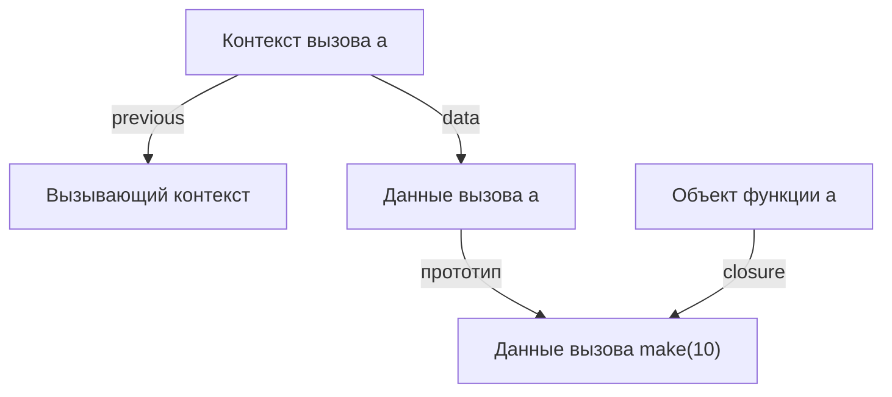

# 10. Контексты, функции и замыкания

[Оглавление](index.md) · [English](../en/10-contexts-and-closures.md) · [Предыдущая глава](09-vm-and-values.md) · [Следующая глава](11-memory-management.md)

Редакция 2. Описываемая реализация: [commit 8d1fe86, с функцией `println`](https://github.com/kniazkov/g0at/tree/8d1fe867ff5272d8d59a44785871f0db1b454df0).

<a id="section-10-1"></a>

## 10.1. Область видимости становится данными

В главе 7 область видимости связывала имя с объявлением в AST. Во время исполнения требуется хранить уже конкретные значения. Для этого используется `context_t` из [context.h](https://github.com/kniazkov/g0at/blob/8d1fe867ff5272d8d59a44785871f0db1b454df0/src/model/context.h): объект данных, ссылка на предыдущий контекст и поля управления возвратом или исключением.

`create_context` создаёт новый пользовательский объект. Его прототипом становится явно переданное окружение либо данные вызывающего контекста. Объявления создают собственные свойства этого объекта. Вложенный блок таким образом видит внешние имена, а собственное объявление может затенить одно из них.

Есть две разные связи: `previous` ведёт назад по ходу исполнения, а прототипы данных определяют поиск имён. Для обычного блока они согласованы. Для вызова замыкания они могут вести к разным окружениям. Смешать их — значит незаметно заменить лексическую область видимости динамической, где имя зависело бы от места вызова.

<a id="section-10-2"></a>

## 10.2. Что сохраняет функция

При `FUNC` VM создаёт динамический объект функции. Он хранит адрес первой инструкции тела, имена формальных параметров, ссылку на данные текущего контекста и необязательный дескриптор нативных специализаций. Ссылка на данные удерживается счётчиком ссылок. Реализация находится в [function.c](https://github.com/kniazkov/g0at/blob/8d1fe867ff5272d8d59a44785871f0db1b454df0/src/model/function.c).

Замыкание — функция вместе с сохранённым лексическим окружением. Goat удерживает объект окружения, а не снимок отдельных значений и не указатель на временную C-структуру контекста. Поэтому запись во внешнюю переменную видна последующим вызовам этой же функции. Отдельные вызовы функции-фабрики создают отдельные окружения.

Тело байткода при этом может быть общим. В примере ниже обе функции-счётчика исполняют одни инструкции, но читают разные объекты с переменной `value`.

На схеме показаны эти связи во время вызова `a` из примера ниже. Контекст выполнения хранит путь возврата, а объект данных вызова наследует окружение функции.



<a id="section-10-3"></a>

## 10.3. Как проходит вызов

`CALL` получает со стека объект функции и вызывает его метод `call`. Для встроенной функции это непосредственный вызов C-исполнителя. Для динамической функции сначала возможен выбор подходящей нативной специализации; этот путь подробно рассматривается в части V. При обычном исполнении байткода выполняются следующие действия:

1. Создаётся контекст вызова. Его `previous` указывает на вызывающий контекст, а прототип данных — на сохранённое окружение функции.
2. Контекст помечается `FLOW_RETURN`; сохраняется адрес следующей после `CALL` инструкции.
3. Фактические аргументы снимаются со стека и связываются с формальными параметрами по порядку.
4. Для отсутствующих аргументов записывается `null`. Лишние уже вычислены, но не получают имён параметров и освобождаются.
5. На стеке резервируется ячейка результата, первоначально содержащая `null`. Исполнение переходит к первой инструкции тела.

Порядок вычисления аргументов остаётся справа налево. Порядок их привязки к параметрам — слева направо. Разницу обеспечивает стек, а не перестановка имён в исходнике.

<a id="section-10-4"></a>

## 10.4. Возврат через вложенные блоки

`RET` снимает возвращаемое значение и записывает его в зарезервированную ячейку. Затем VM уничтожает контексты до границы текущего вызова, сокращает стек до результата, восстанавливает адрес продолжения и вызывающий контекст. `return` внутри нескольких блоков поэтому возвращает из функции, а не только из ближайшего блока.

Обычное завершение блока устроено иначе: `LEAVE` сохраняет его объект данных, уничтожает оболочку контекста и кладёт объект на стек. `RESTORE` только удаляет контекст. Эти инструкции нельзя взаимозаменять: у них разный результат для стека.

Уничтожение контекста уменьшает счётчик ссылок его данных. Оно не обязано уничтожать данные немедленно. Если функция удерживает окружение, значения остаются доступны после возврата создавшего их вызова.

<a id="section-10-5"></a>

## 10.5. Независимые состояния и рекурсия

Файл [10-closures.goat](../examples/10-closures.goat):

```goat
const make = func(start) {
    var value = start;
    return func() { value = value + 1; return value; };
};
const a = make(10);
const b = make(20);
println(a());
println(a());
println(b());
const first = func(x) { return x; };
println(first());
println(first(7, 8));
const factorial = func(n) {
    if (n <= 1) { return 1; }
    return n * factorial(n - 1);
};
println(factorial(5));
```

Результат:

```text
11
12
21
null
7
120
```

`a` и `b` удерживают разные данные вызовов `make`. Два обращения к `a` изменяют одну переменную, а `b` начинает со своего значения. `first` показывает отсутствие проверки точного количества аргументов у пользовательской функции: недостающий становится `null`, лишний не используется.

Рекурсивная `factorial` находит собственное имя через окружение. Каждый вызов создаёт новый контекст с собственным `n` и адресом возврата. Окружение может удерживать функцию, которая удерживает это же окружение: возникает цикл ссылок. Его последствия для памяти рассматриваются в главе 11.

> [!CAUTION]
> Байткодный вызов не выполняет оптимизацию хвостовой рекурсии: каждый такой вызов создаёт очередной контекст. В текущем исполнителе нет общего пользовательского механизма ограничения глубины VM-рекурсии; рост контекстов и стека ограничен доступной памятью. Защитные лимиты нативного пути — отдельный механизм.

<a id="section-10-6"></a>

## 10.6. Процесс и поток в этой реализации

[process.c](https://github.com/kniazkov/g0at/blob/8d1fe867ff5272d8d59a44785871f0db1b454df0/src/model/process.c) создаёт процесс с идентификатором, списками объектов и одним главным потоком. [thread.c](https://github.com/kniazkov/g0at/blob/8d1fe867ff5272d8d59a44785871f0db1b454df0/src/model/thread.c) создаёт поток с текущим контекстом, стеком, номером инструкции, временными операндами и состоянием исключения. Поток также хранит счётчики нативных попыток.

Связи потоков образуют кольцевой список. В цикле VM после инструкции выбирается `thread->next`. При одном потоке это снова он сам. Так устроены внутренние структуры, через которые проходят выполнение и сборка мусора.

> [!CAUTION]
> В языке этой версии нет пользовательских средств создания потоков и синхронизации. Кольцевой список и переключение указателя в VM не являются реализацией параллельного исполнения пользовательской программы на нескольких ядрах.

Здесь «процесс» также обозначает структуру исполнительной среды Goat, а не автоматически созданный отдельный процесс операционной системы. Эти названия следует читать по их фактической роли в коде.

<a id="section-10-7"></a>

## 10.7. Что переживает вызов

После возврата больше не нужны оболочка контекста и временные значения вызова. Однако возвращённый объект, захваченное окружение и данные, достижимые через них, могут жить дальше. Это не исключительный случай, а основа обычной работы замыканий.

Полезно проверить две вещи отдельно: куда `RET` возвращает управление и кто удерживает данные после этого. Первое определяется контекстами и адресами; второе — объектными ссылками. Следующая глава описывает именно вторую сторону, включая случаи, когда счётчики ссылок не могут освободить окружение сами.
