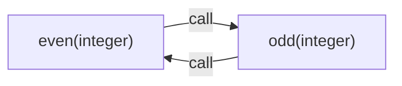

# 18. Граф вызовов и рекурсия

[Оглавление](index.md) · [English](../en/18-call-graph-and-recursion.md) · [Предыдущая глава](17-call-analysis-and-specializations.md) · [Следующая глава](19-effects-and-purity.md)

Редакция 3. Описываемая реализация: [commit cf51b8c, с оператором `for`](https://github.com/kniazkov/g0at/tree/cf51b8cb27a102d15260c7822ce503404462b0fd).

<a id="section-18-1"></a>

## 18.1. Зависимость вместо бесконечного обхода

Для рекурсивной функции результат вызова зависит от результата другого вызова той же функции. Если анализатор просто начнёт подставлять тело вместо каждого вызова, обход может не закончиться. Goat отделяет обнаружение зависимостей от вычисления типов результатов.

Граф вызовов — набор вершин и направленных рёбер. Вершина здесь представляет специализацию: тело функции вместе с типами параметров. Ребро сообщает, что в определённой точке этой специализации возможен вызов другой. Это не журнал фактически выполненных вызовов и не дерево стека одного запуска.

Поэтому одно тело с сигнатурами `(integer)` и `(real)` может занимать две вершины. А тысяча исполнений одного вызова не требует тысячи рёбер: одинаковые наблюдения об одной точке и цели объединяются.

<a id="section-18-2"></a>

## 18.2. Обнаружение целей

[function_call_graph.c](https://github.com/kniazkov/g0at/blob/cf51b8cb27a102d15260c7822ce503404462b0fd/src/analysis/function_call_graph.c) сначала создаёт вершины для уже зарегистрированных сигнатур. Затем исследует их тела с типовыми параметрами. Обнаруженные новые сигнатуры добавляются в конец списка; список одновременно служит очередью работ.

Известное значение функции непосредственно указывает на тело. Если такого значения нет, анализатор пытается разрешить неизменяемую ссылку: пройти через скобки и объявления `const` к узлу функции. Это позволяет находить прямые и взаимные вызовы, не опираясь на случайное состояние одного запуска.

> [!CAUTION]
> Разрешение таких ссылок ограничено 64 шагами и не считает изменяемую переменную постоянной целью. Граф ограничен 1024 вершинами. Неизвестная цель и исчерпание лимита получают отдельные виды рёбер; отсутствие найденной цели не означает отсутствие вызова. При усечении графа дальнейшие доказательства не должны использовать его как полный.

У вершины есть признак полноты. Например, непонятный вызываемый объект делает её неполной. При этом известная часть графа всё ещё полезна для диагностики, но не даёт права забыть неизвестные зависимости.

<a id="section-18-3"></a>

## 18.3. Сильно связные компоненты

Сильно связная компонента — группа вершин, из каждой из которых можно добраться до любой другой по направленным рёбрам. Одна вершина с ребром к себе представляет прямую рекурсию. Две функции, вызывающие друг друга, образуют компоненту взаимной рекурсии.

Goat использует алгоритм Тарьяна: обход хранит номер посещения, минимальный достижимый номер активной вершины (`lowlink`) и стек ещё не выделенных компонентов. Когда найдена граница компоненты, соответствующая часть стека снимается и получает общий номер группы.

Для читателя важнее результат: теперь известно, какие типы необходимо согласовывать совместно. Номер компоненты — идентификатор обхода, а не приоритет функции. Неизвестные цели не превращаются в выдуманные вершины с доказанным поведением.

<a id="section-18-4"></a>

## 18.4. Начальное приближение и неподвижная точка

[function_return.c](https://github.com/kniazkov/g0at/blob/cf51b8cb27a102d15260c7822ce503404462b0fd/src/analysis/function_return.c) решает рекурсивную группу итерациями. Начальный тип результата каждой её специализации — `BOTTOM`. Это начальное отсутствие известных нормальных возвратов, а не утверждение о неисправности функции.

Тело анализируется с общими типами параметров. Рекурсивный вызов использует текущее приближение типа вызываемой специализации. Полученный результат объединяется с прежним и нормализуется до типа. Информация о возможных результатах может расширяться, но уже найденный тип не отбрасывается ради более узкого предположения.

Если очередной полный проход не меняет типы, достигнута неподвижная точка: повтор применения этих правил даёт тот же результат. Она относится к данной абстрактной модели. Это не доказательство завершения программы.

Группа дополнительно расширяется всеми сигнатурами участвующих тел и их рекурсивными компонентами. Поэтому решение учитывает не только одно ребро с совпавшим ключом. При поиске сигнатуры сначала предпочитается точное совпадение типов, затем допустимое более широкое существующее описание.

<a id="section-18-5"></a>

## 18.5. Прямая рекурсия на примере

Файл [18-recursion.goat](../examples/18-recursion.goat):

```goat
const factorial = func(n) {
    if (n <= 1) { return 1; }
    return n * factorial(n - 1);
};
println(factorial(5));
```

Результат:

```text
120
```

Для сигнатуры `(integer)` условие `n <= 1` заранее неизвестно. Базовая ветвь даёт целое. В начале рекурсивная ветвь использует `BOTTOM`; после появления целого приближения произведение также имеет целочисленный тип. Следующий устойчивый проход подтверждает `integer`.

Анализ не вычисляет факториалы всех 64-битных целых. Он решает уравнение типов в конечном наборе описаний. Переполнение результата при больших аргументах подчиняется целочисленной семантике Goat и само по себе не меняет тип на вещественный.

<a id="section-18-6"></a>

## 18.6. Взаимная рекурсия

Файл [18-mutual.goat](../examples/18-mutual.goat):

```goat
const even = func(n) {
    if (n == 0) { return 1; }
    return odd(n - 1);
};
const odd = func(n) {
    if (n == 0) { return 0; }
    return even(n - 1);
};
println(even(6));
```

Он печатает `1`. Для целочисленных сигнатур получается следующая известная зависимость:



Обе вершины относятся к одной рекурсивной группе размера 2. В данном примере журнал сообщает `iterations=2`, тип результата `integer` и `c=supported` для обеих. Число итераций — число оценок сводки при решении, а не количество вызовов во время выполнения.

Эти примеры разделены на два файла намеренно: обычный анализ после рекурсивного вызова может забыть текущие привязки, и последующие вызовы в том же файле не обязательно дадут те же начальные сигнатуры. Это свойство обнаружения фактов, а не изменения результата программы.

<a id="section-18-7"></a>

## 18.7. Когда решения недостаточно

> [!CAUTION]
> Решение рекурсивных типов ограничено 64 проходами. При исчерпании лимита группа получает `inconclusive` и `TOP`; промежуточное приближение не публикуется как готовое доказательство. Неизвестная или не входящая в решаемую группу цель также может сделать анализ незавершённым. При усечённом графе этот решатель не запускается.

Вызовы учитывают возможные изменения окружения: при самовызове забываются захваты, при вызове другого тела применяется более грубое забывание. Это снижает точность, но не позволяет ошибочно удержать константу, изменяемую через замыкание.

Даже устойчивый `BOTTOM` следует читать как отсутствие нормального результата в модели, а не как доказанный текст исключения. Проверки графа и рекурсивных типов находятся в [test_function_call_graph.c](https://github.com/kniazkov/g0at/blob/cf51b8cb27a102d15260c7822ce503404462b0fd/src/test/test_function_call_graph.c) и [test_function_return.c](https://github.com/kniazkov/g0at/blob/cf51b8cb27a102d15260c7822ce503404462b0fd/src/test/test_function_return.c). После типов требуется ещё выяснить, что функция может менять снаружи.
